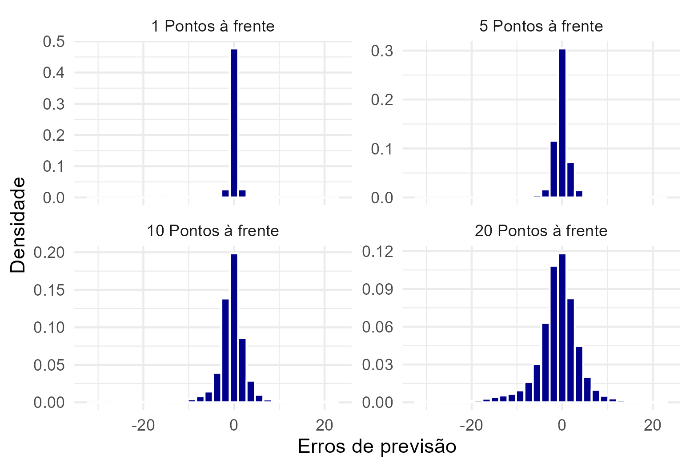

```{r setup, include=FALSE}
knitr::opts_chunk$set(echo = FALSE, fig.align = "center", out.width = "80%")
library(dplyr)
library(ggplot2)
library(sf)
library(lwgeom)
```

## Introducão

### Objetivo

- Usar os dados históricos da SMTR para prever tempos de chegada dos ônibus

### Prévia dos resultados

- Identificamos o tempo de chegada de 75% das observações

- Treinamos modelos estatísticos para prever esses tempos

- No modelo com melhor desempenho, obtivemos:

    - Erro médio de menos de 2 minutos
        
    - Em termos percentuais, erro abaixo de 20%

# Construção da base de dados

## Fontes de dados

### GTFS

- Itinerários possíveis de cada serviço

- Paradas de cada itinerário

### GPS dos ônibus

- Informações de cada ônibus, a cada 30segs-1min

- Coordenadas dos ônibus, velocidade, serviço

## Desafio

- Montar uma base de dados em que possamos prever os tempos de chegada

- Calcular quanto tempo cada ônibus levou para chegar a cada ponto.

### Passos:

1. Identificar qual itinerário cada ônibus está seguindo

2. Detectar todos os pontos que o ônibus tem pela frente

3. Calcular em quantos minutos ele chegou em cada um dos pontos

## Identificando itinerários

Exemplo: linha 309

```{r, warning = FALSE, message = FALSE}
set.seed(271)

itineraries <- readr::read_rds("output/itineraries.rds") %>%
    filter(servico == "309")

map <- readr::read_rds("output/map.rds") %>%
    sf::st_crop(
        sf::st_bbox(sf::st_buffer(itineraries, 5000))
    )

sample_points <- sf::st_geometry(itineraries) %>%
    sf::st_sample(25, type = "regular") %>%
    {.[sf::st_dimension(.) == 0]} %>%
    {.[!sf::st_is_empty(.)]} %>%
    {.[sf::st_is_longlat(.)]} %>%
    sf::st_jitter(factor = 0.1)

distance_lines <- sf::st_nearest_points(sample_points, itineraries)

start <- st_startpoint(distance_lines)

end <- st_endpoint(distance_lines)

ggplot(itineraries, aes(geometry = geometry)) +
    geom_sf(data = map, fill = "transparent") +
    geom_sf(color = "darkblue") +
    geom_sf(data = start, color = "red") +
    geom_sf(data = end, color = "red", shape = 1) +
    geom_sf(data = distance_lines) +
    ggthemes::theme_map()
```
- Projetamos cada observação em seus itinerários possíveis (em geral, ida/volta)

## Identificando itinerários

```{r, out.width="60%"}
ggplot(itineraries, aes(geometry = geometry)) +
    geom_sf(color = "darkblue") +
    geom_sf(data = start, color = "red") +
    geom_sf(data = end, color = "red", shape = 1) +
    geom_sf(data = distance_lines) +
    ggthemes::theme_map()
```


- Tendo os pontos projetados, calculamos a distância que o ônibus viajou ao longo de cada itinerário

- Se essa distância aumenta por 5 observações seguidas, o itinerário deve estar correto

- Se ainda resta mais de um itinerário possível, descartamos

## Identificando itinerários

- Com os itinerários identificados, a base tem o formato

```{r}
knitr::kable(
    data.frame(
        a = c("A1", "A1", "A2"),
        b = c("13:00", "13:01", "13:00"),
        c = c("...", "...", "..."),
        d = c("S1", "S1", "S2"),
        e = c("600m", "900m", "200m")
    ),
    col.names = c("ID Veículo", "Horário", "...", "Shape ID", "Distância viajada")
)
```

<br><br>

- Cerca de 4 milhões de observações por dia, em média

## Identificando paradas

- Dados do GTFS têm a localização de todas as paradas de um itinerário

- Pegamos as 20 paradas seguintes do ônibus, com base na distância projetada

- Um exemplo: cada observação da base de dados, como

```{r}
knitr::kable(
    data.frame(
        a = c("A1"),
        b = c("13:00"),
        c = c("...")
    ),
    col.names = c("ID Veículo", "Horário", "...")
)
```

## Identificando paradas

- Se transforma em uma observação por ponto

```{r}
knitr::kable(
    data.frame(
        a = c("A1", "A1", "A1"),
        b = c("13:00", "13:00", "13:00"),
        c = c("...", "...", "..."),
        d = c("A", "B", "C"),
        e = c("200m", "600m", "1100m")
    ),
    col.names = c("ID Veículo", "Horário", "...", "Parada", "Distância até a parada")
)
```

- A base de GPS tem cerca de 5 milhões de observações/dia, em média

- Se cada ônibus tem 20 pontos pela frente, 100 milhões de observações

- Em um mês, são 3 bilhões de observações -- que de fato obtemos

## Medindo tempos de chegada

- Queremos adicionar uma nova coluna a base, medindo em quantos minutos cada ônibus chegou a cada ponto

- Registramos o horário em que o ônibus chega ao ponto

## Caça aos outliers

## Base de validação

```{r}
table_vars <- readr::read_rds("output/table_vars.rds")

knitr::kable(
    table_vars,
    col.names = NULL,
    caption = "Variáveis"
)
```

## Observações preservadas

```{r}
table_obs <- readr::read_rds("output/table_obs.rds")

knitr::kable(
    table_obs,
    digits = 0,
    col.names = c("Número", "Dados de GPS", "Dados identificados"),
    format.args = list(big.mark = ".", decimal.mark = ",")
)
```

## Tamanho da base final

- Base original tem cerca de 5 milhões de obs./dia, em média

- Perdendo 25% (ônibus parados, fora do trajeto, ...) restam 

# Modelos de previsão

## Modelos

- Modelos de regressão

\[
\text{Tempo de chegada} = F\Big(\text{dist}, \text{veloc}, \text{hora}, \text{trajeto}, \dots \Big)
\]

- Modelo mais básico/benchmark: Médias históricas

    - Quantos minutos, em média, este serviço leva do ponto A ao ponto B às 17h de uma quinta-feira?

- Modelos mais complexos: Random Forest e Redes Neurais

    - Aproveitam todas as variáveis, espremendo o máximo dos dados
    
    - Aprendem relações não-lineares entre as variáveis

## Random Forest

- Árvores de decisão

## Random Forest: um exemplo

```{r, out.width="80%", fig.cap="Uma viagem da linha 309"}

```

## Redes Neurais

- Combinações lineares entre as variáveis, com funções de ativação não lineares

```{r, out.width="100%", fig.align='left'}

```

## Treino e teste

- Escolhemos maio deste ano para testar os modelos

    - Base de treino: 1 a 21 de maio

    - Base de teste: 22 a 31 de maio

- Os modelos apenas aprendem com as observações da base de treino

- Base de teste é usada para medir quão bem eles prevêem fora da amostra

- Para ser viável rodar, armazenamos os dados de cada serviço em um arquivo separado
    
    - Treinamos um modelo de cada tipo por linha

# Resultados

## Resumo das previsões

```{r}
predictions_summ <- readr::read_rds("output/predictions_summ.rds")

knitr::kable(
    predictions_summ,
    digits = 2,
    col.names = names(predictions_summ),
    format.args = list(big.mark = ".", decimal.mark = ",")
)
```

<br><br>

- Random Forest teve melhor desempenho

## Qualidade da previsão em função da distância

```{r, out.width="80%", fig.cap="Raiz do erro quadrático médio"}
knitr::include_graphics("output/plot_performance_rmse.png")
```

## Qualidade da previsão em função da distância

```{r, out.width="80%", fig.cap="Erro percentual absoluto médio"}
knitr::include_graphics("output/plot_performance_mape.png")
```

## Distribuição dos erros de medida

```{r, out.width="80%", fig.cap="Raiz do erro quadrático médio"}
knitr::include_graphics("output/plot_histogram_rmse.png")
```

## Importância de cada variável

```{r, out.width="80%"}

```

# Possíveis próximos passos

## Cobertura das linhas

- Investigar quais serviços têm maior perda de observações e por que

- Identificamos algumas anomalias nos itinerários do GTFS que levam a perdas

    - Algumas shapes vêm em multilinestrings, e nem sempre é claro se as linestrings estão em ordem ou se se sobrepõem

- Maior dificuldade é em identificar o ID do itinerário nos dados -- talvez seja possível direto pelo GPS

- Pode ser melhor juntas agrupar serviços, ex: 309, SN309 no mesmo, para ter maior volume de dados

## Aprimoramento dos modelos

- Analisar que tipo de observações têm erros de previsão maiores -- de um determinado serviço, em determinado trajeto?

- Diferentes arquiteturas de Redes Neurais podem prever melhor

    - Incluir mais camadas pode ajudar, mas tem maior custo computacional
    
    - Tentar diferentes funções de ativações, taxas de aprendizagem
    
    - Transformar variáveis em uma série de indicadoras