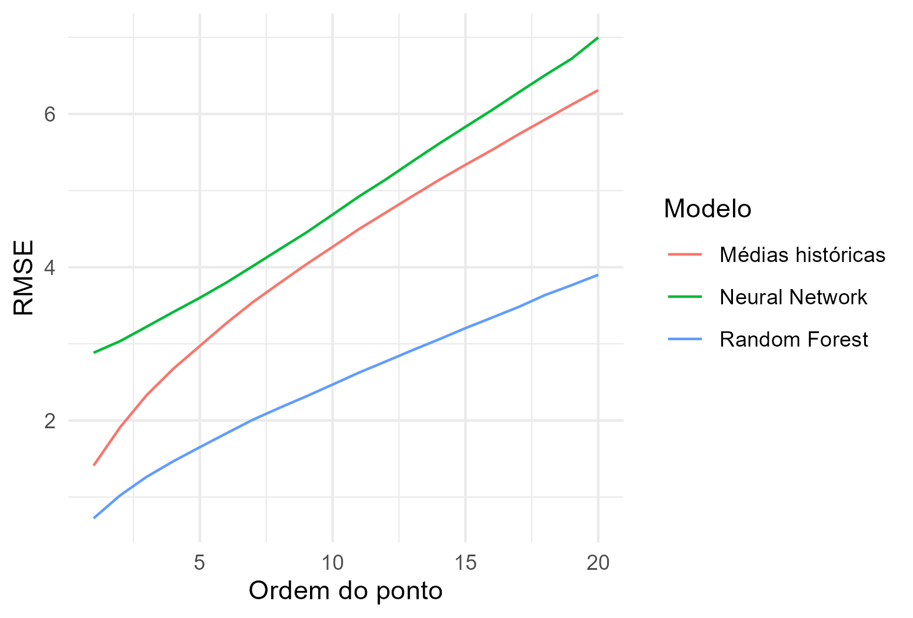

```{r setup, include=FALSE}
knitr::opts_chunk$set(echo = FALSE, fig.align = "center", out.width = "80%")
library(dplyr)
library(ggplot2)
library(sf)
library(lwgeom)
```

## Introducão

### Objetivo

- Usar os dados históricos da SMTR para prever tempos de chegada dos ônibus

### Prévia dos resultados

- Identificamos o tempo de chegada de 75% das observações

- Treinamos modelos estatísticos para prever esses tempos

- No modelo com melhor desempenho, obtivemos:

    - Erro médio de menos de 2 minutos
        
    - Em termos percentuais, erro abaixo de 20%

# Construção da base de dados

## Fontes de dados

### GTFS

- Itinerários possíveis de cada serviço

- Paradas de cada itinerário

### GPS dos ônibus

- Informações de cada ônibus, a cada 30segs-1min

- Coordenadas dos ônibus, velocidade, serviço

## Desafio

- Montar uma base de dados em que possamos prever os tempos de chegada

- Calcular quanto tempo cada ônibus levou para chegar a cada ponto.

### Passos:

1. Identificar qual itinerário cada ônibus está seguindo

2. Detectar todos os pontos que o ônibus tem pela frente

3. Calcular em quantos minutos ele chegou em cada um dos pontos

## Identificando itinerários

Exemplo: linha 309

```{r, warning = FALSE, message = FALSE}
set.seed(271)

itineraries <- readr::read_rds("output/itineraries.rds") %>%
    filter(servico == "309")

map <- readr::read_rds("output/map.rds") %>%
    sf::st_crop(
        sf::st_bbox(sf::st_buffer(itineraries, 5000))
    )

sample_points <- sf::st_geometry(itineraries) %>%
    sf::st_sample(25, type = "regular") %>%
    {.[sf::st_dimension(.) == 0]} %>%
    {.[!sf::st_is_empty(.)]} %>%
    {.[sf::st_is_longlat(.)]} %>%
    sf::st_jitter(factor = 0.1)

distance_lines <- sf::st_nearest_points(sample_points, itineraries)

start <- st_startpoint(distance_lines)

end <- st_endpoint(distance_lines)

ggplot(itineraries, aes(geometry = geometry)) +
    geom_sf(data = map, fill = "transparent") +
    geom_sf(color = "darkblue") +
    geom_sf(data = start, color = "red") +
    geom_sf(data = end, color = "red", shape = 1) +
    geom_sf(data = distance_lines) +
    ggthemes::theme_map()
```
- Projetamos cada observação em seus itinerários possíveis (em geral, ida/volta)

## Identificando itinerários

```{r, out.width="60%"}
ggplot(itineraries, aes(geometry = geometry)) +
    geom_sf(color = "darkblue") +
    geom_sf(data = start, color = "red") +
    geom_sf(data = end, color = "red", shape = 1) +
    geom_sf(data = distance_lines) +
    ggthemes::theme_map()
```


- Tendo os pontos projetados, calculamos a distância que o ônibus viajou ao longo de cada itinerário

- Se essa distância aumenta por 5 observações seguidas, o itinerário deve estar correto

- Se ainda resta mais de um itinerário possível, descartamos

## Identificando paradas

## Medindo tempos de chegada

## Caça aos outliers

## Base de validação

```{r}
table_vars <- readr::read_rds("output/table_vars.rds")

knitr::kable(
    table_vars,
    col.names = NULL,
    caption = "Variáveis"
)
```

# Modelos de previsão

## Modelos

```{r}
table_obs <- readr::read_rds("output/table_obs.rds")

knitr::kable(
    table_obs,
    digits = 0,
    col.names = c("Número", "Dados de GPS", "Dados identificados"),
    format.args = list(big.mark = ".", decimal.mark = ",")
)
```


## Erro Quadrático

```{r, out.width="80%", fig.cap="Raiz do erro quadrático médio"}

```

## Erro Absoluto

```{r, out.width="80%", fig.cap="Erro absoluto médio"}

```

## Erro Percentual

```{r, out.width="80%", fig.cap="Erro percentual absoluto médio"}
knitr::include_graphics("output/plot_performance_mape.png")
```

## Distribuição

```{r, out.width="80%", fig.cap="Erro percentual absoluto médio"}

```

## Benchmark: médias históricas

```{r}
predictions_summ <- readr::read_rds("output/predictions_summ.rds")

knitr::kable(
    predictions_summ,
    digits = 2,
    col.names = names(predictions_summ)
)
```


## Random Forest


## Rede neural

## Arquitetura da rede


# Resultados

# Limitações

## Cobertura das linhas

## Erros de medida