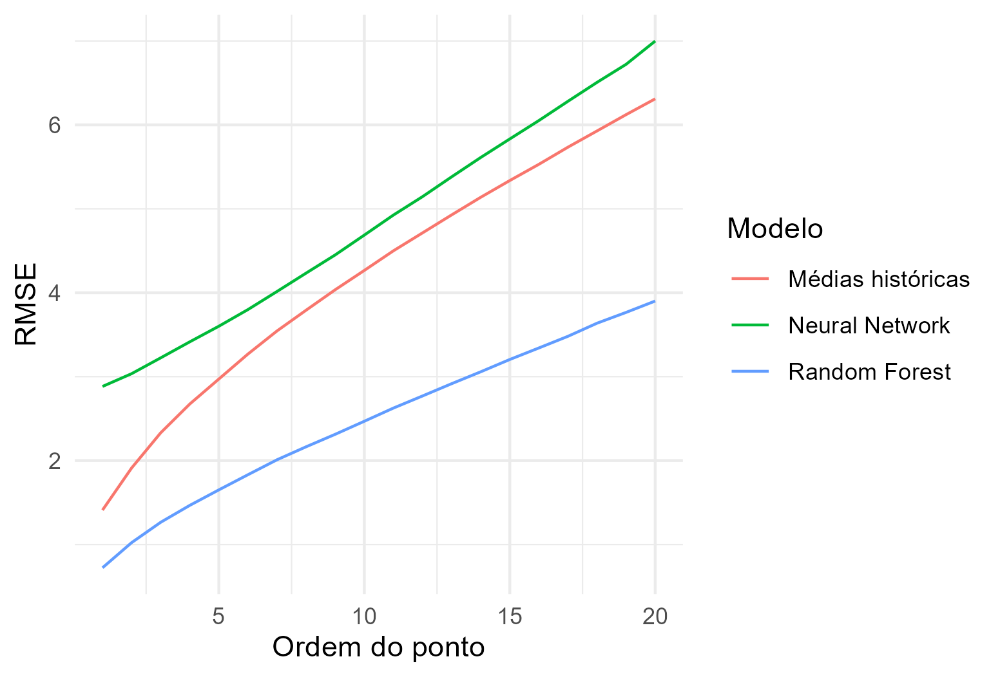
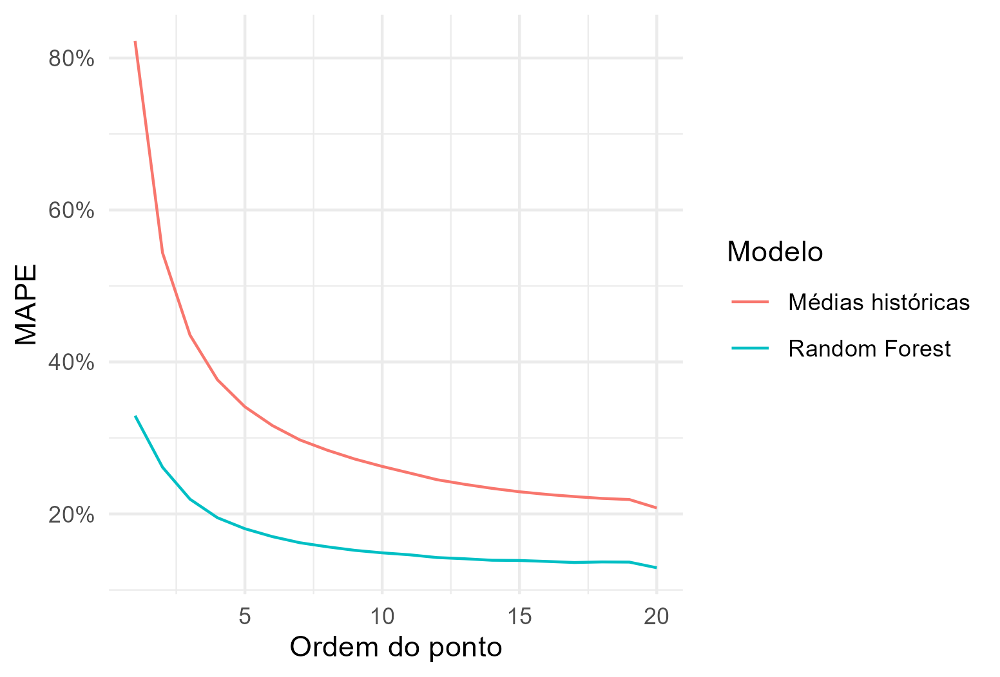

```{r setup, include=FALSE}
knitr::opts_chunk$set(echo = FALSE, fig.align = "center", out.width = "80%")
library(dplyr)
library(ggplot2)
library(sf)
library(lwgeom)
```

## 1. Introdução

A Secretaria Municipal de Transportes do Rio de Janeiro (SMTR) apresentou a professores do Departamento de Economia da PUC-Rio o projeto de gerar modelos capazes de prever o tempo de chegada dos ônibus aos pontos. Os alunos do Departamento de Economia Igor Rigolon (mestrado) e Rafael Palis (graduação), compuseram a equipe participante do projeto. Com a colaboração do Escritório de Dados, tivemos acesso, pelo Datalake da prefeitura, aos dados históricos de GPS dos ônibus da SMTR.

Com esses dados, treinamos modelos de Machine Learning capazes de prever em quantos minutos cada ônibus chegará em determinado ponto, até 20 pontos à frente. O modelo de melhor desempenho obteve um erro absoluto médio de menos de 2 minutos, e um erro percentual médio inferior a 20\%. Esse modelo pode ser usado para prever os tempos de chegada dos ônibus em tempo real, sendo de imensa serventia para os usuários da rede de ônibus do Rio de Janeiro.

## 2. Objetivos

Para chegar em previsões de tempo de chegada, tivemos como passos intermediários:

1. Montar uma base de validação:

    * Calcular, nos dados históricos, os tempos de chegada que de fato ocorreram, para que os modelos possam aprender com o passado.
    
2. Estimar os modelos mais utilizados na literatura

3. Validar o desempenho dos modelos:

    * Treinar os modelos com dados apenas mais antigos, e medir quão bem eles prevêem os tempos de chegada nos dados mais recentes, para simular o desempenho na prática.
    
## 3. Dados

Utilizamos os dados de GPS dos ônibus e do [GTFS](https://gtfs.org/) da SMTR disponíveis no [Datalake da Prefeitura do Rio de Janeiro](https://www.dados.rio/datalake). A tabela abaixo resume os dados encontrados em cada uma das bases de dados.

|Base de dados|Informação|
|:------------|:---------|
|GPS dos ônibus| Coordenadas dos ônibus a cada 30 segundos, com identificador do veículo, código do serviço, e horário|
|GTFS| Itinerários possíveis de cada serviço e todas as suas paradas|

Fizemos o cruzamento entre as bases de dados do GTFS para coletar essa informações de itinerários e paradas, e então unimos esses dados aos de GPS.

## 4. Tratamento dos dados

Para conseguir treinar os modelos, precisamos montar uma base de validação que incluísse alguns dados adicionais. Foi necessário detectar qual itinerário cada ônibus estava percorrendo a cada momento, e detectar quando cada ponto foi ultrapassado. Esta seção descreve as escolhas que fizemos para construir essa base de dados. Todos os códigos de manipulação dos dados foram feitos em SQL, podendo ser implementados diretamente pelo BigQuery.

### 4.1. Identificação das shape_ids

Grande parte dos serviços de ônibus tem mais de um itinerário possível descrito nos dados do GTFS -- em maioria, um de ida e um de volta. Cada itinerário é acompanhado de um código, registrado na variável shape_id. Para prever os tempos de chegada, foi necessário identificar corretamente a shape_id de cada observação.

Para isso, encontramos a menor distância possível entre cada localização dos ônibus e os polígonos de seus itinerários, e projetamos o ponto de GPS naquela aresta. Pela distância total de cada itinerário, calculamos quantos metros cada ônibus viajou desde seu ponto de partida. Esse processo é ilustrado na \autoref{fig1}, que mostra observações fictícias do ônibus 309 (pontos vermelhos) sendo projetadas em seu itinerário. Para cada ponto projetado, calculamos a distância percorrida ao longo da rota desde o ponto de partida.

```{r, warning = FALSE, message = FALSE, fig.cap="\\label{fig1}Projeção dos pontos"}
set.seed(271)

itineraries <- readr::read_rds("output/itineraries.rds") %>%
    filter(servico == "309")

map <- readr::read_rds("output/map.rds") %>%
    sf::st_crop(
        sf::st_bbox(sf::st_buffer(itineraries, 5000))
    )

sample_points <- sf::st_geometry(itineraries) %>%
    sf::st_sample(25, type = "regular") %>%
    {.[sf::st_dimension(.) == 0]} %>%
    {.[!sf::st_is_empty(.)]} %>%
    {.[sf::st_is_longlat(.)]} %>%
    sf::st_jitter(factor = 0.1)

distance_lines <- sf::st_nearest_points(sample_points, itineraries)

start <- st_startpoint(distance_lines)

end <- st_endpoint(distance_lines)

ggplot(itineraries, aes(geometry = geometry)) +
    geom_sf(data = map, fill = "transparent") +
    geom_sf(color = "darkblue") +
    geom_sf(data = start, color = "red") +
    geom_sf(data = end, color = "red", shape = 1) +
    geom_sf(data = distance_lines) +
    ggthemes::theme_map()
```

No nosso código, declaramos que uma shape_id está correta se a distância viajada pelo ônibus cresce por 5 observações seguidas. Isso indica que o ônibus está, de fato, indo na direção prescrita por esse itinerário. Removemos observações em que ainda havia ambiguidade, restando mais de um itinerário possível para o ônibus.

Também removemos observações em que (i) o ônibus está a mais de 500 metros do itinerário, (ii) o ônibus não tem observações nos 3 minutos seguintes, ou (iii) a distância viajada pelo ônibus permanece constante nas 5 observações passadas.

### 4.2. Identificação das paradas

O GTFS registra todas as paradas de cada itinerário possível para um determinado serviço, com a variável `dist_traveled_stop`, que mede a quantos metros (ao longo do itinerário) do ponto de partida fica a parada. Realizamos um join entre o GPS com shape_ids identificados e a base de paradas do GTFS, mantendo apenas as paradas seguintes: paradas tais que a `dist_traveled_stop` é maior do que a distância projetada que ônibus viajou, ao todo, no passo anterior. Também calculamos a variável `stop_order`, que conta quantos pontos à frente a parada está: é 1 para o ponto seguinte, 2 para o depois dele, e assim por diante. Para reduzir o volume de dados e ter um horizonte de previsão mais próximo, restringimos a base a até 20 pontos à frente, com `stop_order` $\leq 20$.

### 4.3. Cálculo dos tempos de chegada

Sabendo todas as paradas que cada ônibus tem pela frente, calculamos os tempos de chegada da seguinte forma: consideramos que um ônibus chegou ao ponto quando sua distância projetada viajada supera a `dist_traveled_stop`. Então registramos o horário em que observamos o ônibus tendo ultrapassado o ponto, e trouxemos esse valor para as observações anteriores. Assim, pudemos subtrair o horário anterior do horário de chegada, para obter o tempo de chegada.

### 4.4. Estrutura da base de validação

A tabela abaixo apresenta as variáveis presentes na base de validação construída por meio dos passos acima, que utilizamos para aplicar os modelos.

```{r}
table_vars <- readr::read_rds("output/table_vars.rds")

table_vars <- bind_cols(
    table_vars,
    cod = c("data", "servico", "posicao_veiculo_geo", "velocidade_instantanea",
            "velocidade_estimada_10_min", "stop_sequence", "dist_to_stop",
            "dist_traveled_shape", "stop_order", "arrival_time", "shape_id",
            "hora", "day_of_week")
)

knitr::kable(
    table_vars,
    col.names = c("Nome", "Detalhes", "Código")
) %>%
    kableExtra::kable_styling(font_size = 10)
```

## 5. Modelos de previsão

O problema de previsão que enfrentamos é tratado com modelos de regressão: modelos que estimam uma variável $y$ -- no caso, o tempo de chegada -- com base em diversas variáveis $x$ -- posição do ônibus, distância ao ponto, horário, velocidade, etc. Testamos algumas classes de modelos diferentes, descritos abaixo:

* Médias históricas: utilizamos como benchmark o modelo mais simples, que calcula a média de tempo que cada serviço levou para chegar a uma certa parada, quando ela estava algum número de pontos a frente, a depender do horário e do dia da semana.

* Regressão linear: modelos de média condicional ainda simples. Testamos diversas especificações, incluindo efeitos fixos de serviço-hora e coeficientes variáveis por serviço-hora. Optamos por não utilizar esses modelos na base completa, porque eles tinham poucos ganhos em relação às médias históricas.

* Floresta Aleatória: modelos de regressão não-linear, calculados a partir da média de muitas árvores de regressão.

    * Testamos diferentes números de árvores e profundidades. A previsão parou de melhorar acima de 300 árvores, então este foi o valor escolhido. Deixamos a profundidade sem um limite manual, a ser determinada pelo algoritmo de otimização. A variável shape_id entrou como variável categórica.

* Redes Neurais: classe de modelos tida por @reich2019survey como a de maior sucesso na literatura de previsão de tempos de ônibus. @tran2020deeptrans também mostra que redes neurais profundas podem gerar boas previsões, incorporando informações de trânsito.

    * Usamos uma arquitetura simples com 12 neurônios de entrada, um hidden layer com 6 neurônios e função de ativação ReLu, e um neurônio de saída com ativação linear. Usamos otimização por gradiente estocástico, ajustando os hiperparâmetros de batch_size (foi usado um valor relativamente pequeno) e de número de epochs, com early stopping quando a perda na base de validação estagnava. Além disso, padronizamos todas as variáveis para média 0 e desvio padrão 1, e fizemos one-hot encoding na variável de shape_id.
    
    * Também testamos uma arquitetura com duas camadas ocultas, mas não houve grandes mudanças no desempenho.
 

Todos os modelos foram treinados utilizando dados de 01/05/2024 até 21/05/2024, separados por linha. Então testamos o desempenho dos modelos na base de teste, de 22/05/2024 até 31/05/2024, e calculamos as seguintes medidas de erro de previsão, onde $y$ é o tempo de chegada observado, e $\widehat{y}$ é o tempo de chegada previsto pelos modelos. Agregamos os erros de cada linha por médias ponderadas pelo número de observações. Para ser computacionalmente viável, usamos uma amostra aleatória de 10\% das observações no período.

1. Raiz do erro quadrático médio: medida canônica para avaliação de modelos
\[
    \mathrm{RMSE} = \frac{1}{N}\sqrt{\sum_i (y_i - \widehat{y}_i)^2}
\]

2. Erro absoluto médio: menos sensível a outliers
\[
    \mathrm{MAE} = \sum_i \frac{1}{N}\lvert y_i - \widehat{y}_i\rvert
\]

3. Erro percentual absoluto médio: em termos relativos
\[
    \mathrm{MAPE} = \frac{1}{N}\sum_i \frac{\lvert y_i - \widehat{y}_i\rvert}{y_i}
\]

4. Desvio absoluto mediano: uma medida de estabilidade dos erros de previsão.
\[
    \mathrm{MAPE} = \mathrm{mediana}\Big(\big\lvert (y_i - \widehat{y}) - \mathrm{mediana}(y_i - \widehat{y})\big\rvert\Big)
\]

## 6. Resultados

As medidas de desempenho de previsões fora da amostra estão compiladas na tabela abaixo.

```{r}
predictions_summ <- readr::read_rds("output/predictions_summ.rds")

knitr::kable(
    predictions_summ,
    digits = 2,
    col.names = names(predictions_summ),
    format.args = list(big.mark = ".", decimal.mark = ",")
)
```

O modelo de melhor desempenho foi o Random Forest. Ele obteve um erro quadrático médio com raiz abaixo de 3 minutos, erro absoluto médio inferior a 2 minutos, e erro percentual de menos de 20\%. O desvio absoluto mediano significa que, em 50\% das observações, o erro desviou menos de 0,9 minutos de sua mediana. Isso indica que o modelo tem excelentes previsões na maior parte do tempo. A \autoref{fig2} mostra como a qualidade das previsões varia com quantos pontos à frente a previsão é feita.


```{r, out.width="80%", fig.cap="\\label{fig2}Raiz do erro quadrático médio"}

```

Vemos que o Random Forest tem sempre erros menores do que os demais modelos. Prevendo até 5 pontos à frente, o RMSE é inferior a 2 minutos; 10 pontos à frente, inferior a 2,5 minutos; e, mesmo 20 pontos à frente, é inferior a 4 minutos. A \autoref{fig3} mostra os erros em termos percentuais. Omitimos o modelo de Rede Neural, que tinha erros muito elevados.


```{r, out.width="80%", fig.cap="\\label{fig3}Erro percentual absoluto médio"}

```

Novamente, o modelo de Random Forest tem desempenho melhor em todos os horizontes. Seu erro percentual é um pouco mais alto para distâncias próximas -- já que cada minuto de erro representa uma porcentagem maior -- mas fica sempre abaixo de 20\% a partir de 5 pontos à frente. Mais de 10 pontos à frente, o erro cai abaixo de 10\%.


## 7. Desafios

As maiores dificuldades para o projeto foram:

* Identificar as shape_ids corretas:

    * Como este dado não está associado à observação do GPS, temos que identificá-la pelas posições dos ônibus.

    * Perdemos cerca de 25\% de observações em que não conseguimos identificar a shape_id ou o tempo de chegada corretamente.
    
    * Há algumas anomalias no GTFS de `ShapesGeom`. Para a maioria dos serviços, a variável de `shape`, que contém o itinerário, é uma `linestring`. Mas em uma parcela delas, é em formato `multilinestring`, com várias `linestrings` agrupadas. Não é claro se é uma sequência de `linestrings` que formam o trajeto completo, ou se são caminhos alternativos. Por causa disso, perdemos uma parte das observações.
    
* Volume de dados:

    * A base de validação completa para o mês de maio tem 3 bilhões de observações (porque cada observação original tem até 20 pontos à frente, que se tornam observações separadas).
    
    * Mesmo trabalhando com uma amostra aleatória de 10\%, os modelos de Random Forest e de Rede Neural demoraram pouco mais de 24h para serem treinados e terem o desempenho avaliado.
    
    * Como tivemos que trabalhar com os dados em nossos computadores pessoais, a restrição de tempo não permitiu que treinássemos uma maior variedade de modelos, e que aprimorássemos a Rede Neural.

## 8. Próximos passos

Para que as previsões sejam aplicadas na prática, essa manipulação de dados e os modelos devem ser implementados na arquitetura da Prefeitura, para se tornarem parte do site Mobilidade Rio. Trazemos abaixo algumas possíveis mudanças que facilitariam essa implementação.

* Incorporar a variável shape_id na base de validação: talvez seja possível que o dispositivo de GPS transmita diretamente essa informação. Isso agilizaria o tempo de execução e aumentaria a precisão das estimativas.

* O código de SQL de manipulação de dados, na prática, tendo os modelos treinados e agindo nos dados em tempo real, precisa apenas identificar os pontos seguintes, sem a parte de calcular tempos de chegada -- já que, no mundo real, não os saberemos.

* Enquando o código ainda precisa identificar shape_ids, a inconsistência das `multilinestrings` descrita na seção de Desafios precisa ser investigada.

* Podem ser necessários recursos de computação em nuvem para treinar os modelos com grande volume de dados.

* Diferentes arquiteturas de Rede Neural e de Random Forest ainda podem ser testadas. Em particular, pode-se treinar os modelos alimentados apenas das variáveis originais do GPS -- longitude, latitude, serviço, horário, e velocidade. Esses modelos podem ser treinados com custo computacional muito mais baixo. Além de serem mais simples, os dados em tempo real não precisarão passar por pré-processamento para que eles dêem uma previsão, o que deve facilitar a implementação.

* O Random Forest sem utilizar a variável shape_id performou bem. Isso indica que o modelo é capaz de perceber padrões de itinerários mesmo com menos dados. A única ressalva é que, se houver mudança dos itinerários, a projeção pode ser muito pouco precisa.

## 9. Referências

* Todos os códigos utilizados e resultados produzidos podem ser acessados no [repositório do projeto](https://github.com/prefeitura-rio/smtr_previsao_tempo_chegada/tree/master/puc) no GitHub.
